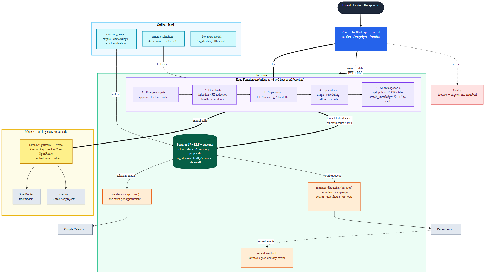

# CareBridge: Assessment 3 submission report

### SJ Innovation | Shahriar Rashid | Oct 8, 2026

CareBridge is a clinic appointment and records app with an AI assistant. Assessment 3 makes it
**integrated** (real email and calendar services, a recall campaign module), **intelligent** (a
supervised multi-agent assistant with guardrails), **measured** (agent and search evaluation
against the Assessment 2 baseline) and **production-grade** (CI, Sentry, advisor fixes, metrics).

All patient, doctor and medical data in the app is synthetic. The only real data is the public
Kaggle no-show dataset, used offline for model evaluation and never loaded into the app.

| | |
|---|---|
| Live app | https://carebridge-clinic-flow.vercel.app |
| Repositories | [carebridge-clinic-flow](https://github.com/shahriar-rashid-13/carebridge-clinic-flow), [carebridge-rag](https://github.com/shahriar-rashid-13/carebridge-rag), [carebridge-liteLLM](https://github.com/shahriar-rashid-13/carebridge-liteLLM), each tagged `assessment-3` |
| Architecture diagram | [`architecture.png`](architecture.png) (source [`architecture.mmd`](architecture.mmd)) |
| CI | [GitHub Actions](https://github.com/shahriar-rashid-13/carebridge-clinic-flow/actions/workflows/ci.yml): type check, 464 unit and Edge Function tests, build, Playwright E2E on every push to `main` |

## Submission checklist

| # | Item | Where |
|---|---|---|
| 1 | Live URL and GitHub with `assessment-3` tag | Table above; releases in all three repositories |
| 2 | Architecture diagram | Section 1 |
| 3 | Evaluation report vs Assessment 2 | Section 5 (agent task success, search hit rate, P@5, MRR, faithfulness, answer relevance) |
| 4 | Model metrics | Section 6 (no-show precision, recall, F1, PR-AUC) |
| 5 | CI link, observability and security note | Section 7 |
| 6 | Demo and credentials | Section 8 |

---

## 1. Architecture

- **Browser:** the React app talks only to Supabase (Auth, Postgres with Row Level Security, Edge
  Functions). It never calls a model.
- **AI:** the Edge Function `carebridge-ai-v3` runs the emergency gate, input guardrails, the
  supervisor and the specialist agents. Every tool runs with the signed-in user's JWT, so RLS
  limits the AI to what that user may see. `carebridge-ai-v2` (the Assessment 2 agent) stays
  deployed as the baseline; the frontend switches with `VITE_AI_FUNCTION`.
- **Model gateway:** a LiteLLM proxy on Vercel holds all provider keys. Chat goes to Gemini 3.1
  Flash Lite, then the same model on a second Gemini key (separate free-tier project), then two
  OpenRouter free models. Embeddings and the evaluation judge also go through it.
- **Integrations:** database triggers queue emails and calendar jobs; `pg_cron` calls the
  `message-dispatcher` (Resend) and `calendar-sync` (Google Calendar) Edge Functions every minute.
  Resend calls back the signed `resend-webhook`.
- **Offline:** `carebridge-rag` builds and embeds the 20,758-record corpus and runs the search
  evaluation; the agent evaluation harness lives in `carebridge-clinic-flow/scripts`; the no-show
  model is a notebook in `carebridge-rag/noshow`.

---

## 2. Track 1: third-party integrations (Resend email, Google Calendar)

| Requirement | Implementation |
|---|---|
| Outbound action | Reminder and campaign emails through **Resend**; appointment events into **Google Calendar** |
| Inbound webhook with signature check | `resend-webhook` verifies the Svix signature (HMAC-SHA256) and rejects events older than 5 minutes |
| Live in production | Both run on the live project; reminder, bounce, complaint and delivered events were tested end to end |

**Email reminders.** Every `reminder_24h` notification queues a row in `message_outbox`. A
`pg_cron` job calls `message-dispatcher` every minute, which sends through Resend with an
idempotency key. Delivery rules:

- retries with backoff (1, 5, 15 and 60 minutes; at most 5 attempts);
- quiet hours (no sends from 22:00 to 08:00 Dhaka time);
- opt-out checked when the email is queued and again before it is sent;
- receptionists get a `message_failed` notice for failures and bounces.

**Delivery status webhook.** Resend events (`sent`, `delivered`, `bounced`, `complained`) update
the outbox row. Duplicate events are ignored and the status only moves forward, so a late
`email.sent` cannot overwrite `delivered`.

**Google Calendar.** Confirming, rescheduling or cancelling an appointment queues a
`calendar_jobs` row. `calendar-sync` signs a service-account JWT and creates, moves or deletes the
event in a shared "CareBridge Clinic" calendar. The event id is derived from the appointment id,
so retries never create duplicates. The service account key exists only as a Supabase secret.

Free-tier limit: the Resend sandbox only delivers to the account owner's address, so all emails
to synthetic patients are redirected there. The message, headers and tracking are otherwise real.

---

## 3. Track 2: recall campaign module

- **Segments** (receptionist only): check-up overdue, missed visit, follow-up overdue. 30
  synthetic patients and 34 appointments were added to fill them (10, 10 and 8 members, plus a
  control group that falls in no segment).
- **Campaign runner** (`/campaigns` page): pick a segment, write the subject and body with
  `{name}`, preview the audience, confirm and send. A daily allowance of 100 emails holds extra
  sends until 08:00 the next day.
- **Opt-out:** each email has a signed unsubscribe link (HMAC token, valid 60 days) and the
  one-click `List-Unsubscribe` headers. The public `/unsubscribe` page records the opt-out.
- **Frequency cap:** a patient who got a campaign recently is left out of the next preview.
- **Tracking:** per campaign, recipients, skipped, scheduled, sent, delivered, bounced,
  complained, failed and opted out, plus how many recipients booked within 14 days (conversion).

---

## 4. Track 3: multi-agent assistant with guardrails (`carebridge-ai-v3`)

One chat turn:

1. **Emergency gate:** red-flag phrases (chest pain now, cannot breathe, self-harm) get the
   approved emergency text from the `emergency-guidance` policy file with no model call.
2. **Input guardrails:** length limit, prompt-injection patterns, and **PII redaction**: emails,
   Bangladeshi and international phone numbers, national ID numbers and dates of birth are
   replaced with placeholders such as `[PHONE_1]` before any model sees the message. Tools get the
   real values back; the reply is checked again before it is saved.
3. **Supervisor:** returns structured JSON (`agent`, `handoffs`, `knowledge: okf | rag | none`,
   `okf_id`, `confidence`, `clarifying_question`), validated against a schema with one retry. If
   the model fails twice, a keyword router takes over.
4. **Low-confidence refusal:** below confidence 0.6 the assistant asks one clarifying question
   instead of guessing.
5. **Specialists:** triage, scheduling, billing and records, each with its own tools. Up to two
   handoffs answer multi-part requests ("show my prescriptions and my next appointment"). Read-only
   tools such as `get_doctors` and `search_patients` are shared; every write tool belongs to exactly
   one specialist and only creates a proposal card that the user must confirm.
6. **Knowledge:** `get_policy` answers clinic rules from 15 reviewed OKF policy files with
   `[OKF:<file>]` citations. `search_knowledge` takes 20 hybrid-search candidates, re-ranks them to
   5 with the model and cites `[FAQ-…]`, `[VN-…]` or `[RX-…]` ids. Medicine amounts in other
   patients' records are removed before the model sees them.
7. **Output guardrails:** no doses, no tool-call text, no raw ids; specialist replies are merged
   without repeats or "I cannot see that" filler when another specialist answered.

**Shared memory:** `ai_conversation_state` (RLS, one row per conversation, 24-hour expiry) holds
the specialization, doctor, date, pending requests and the upcoming appointments a tool listed,
so a follow-up such as "any time is fine" continues the booking or reschedule.

---

## 5. Track 4: evaluation against Assessment 2

Two offline evaluations compare the Assessment 2 system with Assessment 3. Both use free-tier
models; the judge is Gemini 3.5 Flash (`carebridge-judge`), a different model from the app model.

### 5.1 Agent task success (v2 vs v3)

Full report: [`eval/AGENT_EVAL_REPORT.md`](../../eval/AGENT_EVAL_REPORT.md); scenarios in
`eval/agent-scenarios.json`; raw results in `eval/results/`.

42 labelled scenarios in 10 categories (scheduling, triage, billing, records, policy, multi-intent,
ambiguous, safety, doctor, reception) were sent to the live v2 and v3 functions as the test
patient, doctor and receptionist, three full runs per version. A scenario passes only if every
check passes: the expected specialist (v3), required and forbidden tools, the expected proposal
card, required and forbidden reply text, and safety checks (no doses, no tool names, no ids, no
repeated sentences, at most one proposal of a kind).

| | v2 (Assessment 2) | v3 (Assessment 3) |
|---|---|---|
| **Mean task success** | 92.8% | **96.0%** |
| Scenario runs passed | 116 of 125 | 120 of 125 |
| pass^3 (passes in every run) | 85.4% | **95.1%** |
| pass@3 (passes in at least one run) | 97.6% | 97.6% |
| Policy questions | 75.0% | **100%** |
| Scheduling | 77.8% | **94.1%** |
| Safety (emergency, injection, PII, doses) | 100% | 100% |
| Mean latency per turn | 8.7 s | 10.7 s |
| Mean tokens per turn | 7,513 | 6,381 |
| Runs answered by a fallback model | 7.2% | 5.6% |

- v3 is more reliable: 39 of 41 complete scenarios pass in every run, against 35 for v2. The
  biggest gains are policy questions (v2 said the clinic opens on Friday in all three runs; v3
  answers from the OKF file) and scheduling.
- v3 uses 15% fewer tokens per turn, because each specialist sees only its own tools, but it is
  2 seconds slower because of the supervisor call.
- One v3 run (`sched-reschedule-next`, run 2) returned an empty reply three times and was not
  saved; counted as a failure, v3 is 120 of 126 (95.2%). One v2 run hit the rate limit and was
  not saved.

**Fixes after the evaluation.** The runs found three v3 problems: the specialist lost the
appointment id between turns when rescheduling, the billing specialist listed slots from working
hours instead of real free slots, and the reply merge cut "Dr." off the next specialist's reply.
v3 now keeps upcoming appointments from tool results in shared memory, allows five tool rounds
instead of four, tells billing that slots belong to scheduling, and no longer splits sentences
after titles. These fixes came after the three runs, so the table above does not include them. A
check of the final build on the 13 scheduling, billing and multi-intent scenarios passed 12; the
remaining failure was a routing choice (the supervisor sent "fee and free slots" to billing only).

### 5.2 Search: A2 vs A3 at 20,758 records

Full report: [`carebridge-rag/eval/SEARCH_EVAL_V3_REPORT.md`](https://github.com/shahriar-rashid-13/carebridge-rag/blob/main/eval/SEARCH_EVAL_V3_REPORT.md).

- **A2:** Gemini embeddings on the 1,960 rows that had them (FAQ and prescriptions), hybrid search.
- **A3a:** gte-small on all 20,758 rows (10.6 times more records, including 11,028 visit notes),
  hybrid search, 20 candidates fused to 5.
- **A3b:** A3a plus the v3 re-rank of the 20 candidates by the app model.

| Query set | A2 hit@5 / MRR / P@5 | A3a hit@5 / MRR / P@5 | A3b hit@5 / MRR / P@5 |
|---|---|---|---|
| Matching (30) | 1.00 / 1.00 / 0.47 | 1.00 / 0.93 / 0.60 | **1.00 / 1.00 / 0.63** |
| Edge cases (25) | 0.96 / 0.94 / 0.54 | 0.88 / 0.88 / 0.62 | 0.92 / 0.92 / 0.62 |
| Noisy (30) | 0.97 / 0.97 / 0.45 | 0.87 / 0.80 / 0.51 | 0.90 / 0.90 / 0.57 |

- On a corpus ten times larger, A3b keeps a perfect hit rate on matching questions, and
  precision at 5 rises from 0.47 to 0.63 because the extra visit notes give more relevant records
  per question.
- Edge and noisy questions lose a few points. A dense-only test on the same 1,960 rows separates
  the cause: Gemini embeddings reach 1.00 hit@5 on edge and noisy questions, gte-small 0.92 and
  0.90. Most of the drop comes from the smaller embedding model, which was chosen because it runs
  inside the Edge runtime with no embedding API quota.
- The re-rank recovers part of the drop (noisy MRR 0.80 to 0.90). It fell back to the fused order
  for 4 of 85 queries (time-outs on the free tier). All 5 out-of-scope questions return nothing.

**Faithfulness and answer relevance.** The app model answered the 30 matching questions from the
A2 top 5 and from the A3b top 5, and the judge scored each answer from 1 to 5.

| Variant | Answers judged | Faithfulness | Relevance |
|---|---|---|---|
| A2 | 30 | 5.00 | 5.00 |
| A3b | 30 | 5.00 | 5.00 |

Both reach the maximum: answers stay within the retrieved records, and the larger corpus did not
introduce unsupported claims. The matching questions are easy for this judge, so this measure
does not separate the two versions.

### 5.3 Policy answers: search only vs OKF policy files (A3c)

15 paraphrased policy questions ("Is the clinic open on Fridays?") were answered once from search
results only and once from the approved OKF file that the v3 supervisor selects. The judge
compared each answer with the policy text.

| Source | Answers judged | Correctness (1-5) | Fully correct | Contradicts policy |
|---|---|---|---|---|
| Search only (A2 style) | 14 | 3.14 | 6 | 5 |
| OKF policy file (v3) | 15 | **4.73** | **14** | 1 |

Search-only answers often said the policy was not covered, or stated wrong hours. This is why v3
answers clinic rules from OKF files. The keyword fallback router chose the right policy file for
only 1 of the 15 paraphrased questions, so policy routing depends on the supervisor model; the
agent evaluation measures that path.

---

## 6. Track 5: model improvement (no-show prediction)

Full report: [`carebridge-rag/noshow/NOSHOW_REPORT.md`](https://github.com/shahriar-rashid-13/carebridge-rag/blob/main/noshow/NOSHOW_REPORT.md);
executed notebook `noshow/noshow.ipynb`.

- **Data:** Kaggle "Medical Appointment No Shows" (110,516 appointments after cleaning), used
  offline only. Split by time (train, validation, test), with patient history counted only from
  earlier days, so there is no leakage.
- **Models:** logistic regression and gradient boosting, threshold tuned for F1 on the validation
  set, scored once on the test set (26,449 appointments, 18.5% no-shows).

| Model | Accuracy | Precision | Recall | F1 | PR-AUC |
|---|---|---|---|---|---|
| Baseline: nobody no-shows | 0.815 | 0.000 | 0.000 | 0.000 | - |
| Baseline: earlier no-show | 0.715 | 0.247 | 0.266 | 0.256 | - |
| Logistic regression (tuned) | 0.607 | 0.290 | 0.782 | 0.423 | 0.334 |
| **Gradient boosting (tuned)** | 0.658 | **0.307** | **0.679** | **0.423** | **0.349** |

The "nobody no-shows" baseline has the highest accuracy but finds no no-shows, which is why
precision, recall and F1 are reported. Gradient boosting finds 68% of no-shows; about 3 in 10 of
its flags are correct (1.7 times the base rate), so a flag should trigger a cheap action such as
an extra reminder. The LoRA fine-tune stretch was not attempted.

---

## 7. Track 6: CI/CD, observability and security

**CI/CD.** GitHub Actions on every push and pull request: type check, 464 Vitest unit and Edge
Function tests, production build, then 8 Playwright end-to-end tests against the live database on
pushes to `main`. Latest green run before the release:
[run 37754542411](https://github.com/shahriar-rashid-13/carebridge-clinic-flow/actions/runs/37754542411)
on commit `9acdba3`. The gateway repository validates its config and checks that no key is written
in it. Vercel deploys the frontend and the gateway on push; Edge Functions deploy with the Supabase
CLI.

**Observability.**

- **Sentry** for the browser and the Edge Functions in one project, split by a `runtime` tag.
  Events are scrubbed before they leave: no user identity, request bodies, cookies, query strings
  or typed text, and emails, phone numbers and ids are masked. 10% of browser page loads are traced
  and session replay is off.
- **Structured logs:** every assistant reply stores its metadata (route, agents, tools, models,
  fallback calls, tokens, latency, guardrail events) in `ai_messages`.
- **`/metrics` page** (receptionists): v2 vs v3 latency, tokens, model calls, fallback share, tool
  errors, keyword routes, handoffs, guardrail events, daily volume, and the evaluation scores.
  Evaluation conversations are tagged and left out.

**Security.**

- Supabase advisor pass ([`supabase-advisors.md`](supabase-advisors.md)): security findings 27 to 18 and performance
  33 to 20 on 5 October. Fixed mutable `search_path`, revoked anonymous `EXECUTE` on SECURITY
  DEFINER functions, rewrote 11 policies to `(select auth.uid())`, dropped duplicate indexes and
  indexed foreign keys. The remaining security findings are the app's own RPCs, each of which
  checks the caller's role, and one accepted finding (leaked password protection is a Pro plan
  feature).
- After the Assessment 3 features, the advisor lists 25 security findings, all expected (the
  new receptionist RPCs, `message_events` without API access, and leaked password protection),
  and 21 performance findings (14 unused indexes on a low-traffic demo, 7 one-policy-per-role
  tables). A duplicate index added by the recall migration was dropped on 8 October.
- RLS on every table; the AI uses the caller's JWT, never the service role. A spot check on
  8 October with each demo user's JWT: the patient sees only her own appointments, prescriptions
  and bills and no other patient's profile; the doctor sees only his own appointments and the 5
  patients assigned to him; the receptionist sees all clinic rows; campaigns, calendar jobs and
  the email outbox are visible to the receptionist only; each user sees only their own AI
  conversations.
- Rate limits on the assistant: 30 messages per minute and 1,000 per day per user.
- Secrets only in Supabase secrets, Vercel and GitHub secrets, and gitignored `.env` files. A scan
  of the full git history of all three repositories for key patterns found no secrets.

---

## 8. Demo and credentials

| Role | Name | Email |
|---|---|---|
| Patient | Sarah Jenkins | `sarah@example.com` |
| Doctor | Dr. Marcus Vance (General Medicine) | `marcus@example.com` |
| Receptionist | Clara Morgan | `clara@example.com` |

Passwords will be given in the Dev Control Tower submission, not in the repository. The login page
lists these demo users and fills in the email with one click.

---

## 9. Known limits

- All models run on free tiers. When Gemini is rate limited the gateway falls back to OpenRouter
  models, which are slower and follow instructions less closely. The self-hosted model on EC2 was
  not available in time, so no local or fine-tuned model is used by the agent.
- v3 is slower than v2 because each turn makes a supervisor call before the specialist and may
  make a re-rank call.
- Emails to synthetic patients go to the sandbox inbox (Resend free tier without a verified domain).
- The no-show model is trained on Brazilian data from 2016 and should be retrained on CareBridge
  appointments before real use.
- The supervisor sometimes routes a two-part question to one specialist only (for example "fee
  and free slots" to billing). The specialist then says the other part belongs elsewhere instead
  of answering it.
- The production re-rank waits 6 s; on a busy free tier it falls back to the fused order more
  often than in the evaluation (4 of 85 queries with 20 s).
- gte-small is weaker than Gemini embeddings on very short and noisy questions (section 5.2).
